# flex

> 2009年，W3C 提出了一种新的方案----Flex 布局，可以简便、完整、响应式地实现各种页面布局。目前，它已经得到了所有浏览器的支持，这意味着，现在就能很安全地使用这项功能
>
> Flex 是 Flexible Box 的缩写，意为"弹性布局"，用来为盒状模型提供最大的灵活性

## 练习html

基于以下html来开始学习，运行该html后，布局样式为1至9从上而下排列，每个的宽度都为100px

```html
 <div class="flex-practise">
      <div class="item">1</div>
      <div class="item">2</div>
      <div class="item">3</div>
      <div class="item">4</div>
      <div class="item">5</div>
      <div class="item">6</div>
      <div class="item">7</div>
      <div class="item">8</div>
      <div class="item">9</div>
    </div>
    <style>
      body{
        
      }
      .flex-practise {
        width: 300px;
        height: 300px;
        background-color: #eeeeee;
        /* 此处的下方编写css */
        
        /* 此处的上方编写css */
      }
      .item {
        width: 33.33%;
        height: 33.33%;
        color: #ffffff;
        display: flex;
        justify-content: center;
        align-items: center;
        font-size: 30px;
        background-color: #000000;
        border: 1px solid #fff;
        box-sizing: border-box;
        border-radius: 15px;
      }
    </style>
```


## display: flex

采用flex布局的元素，又称为`flex容器`(flex container)，它的`每个子元素`自动成为容器成员，又称为`flex项目`(flex item)，简称`项目`

实际开发中，flex布局常用于使所有`独占一行的块级子元素`(基本上是`div`)，变为一行显示

示例代码如下，布局样式变为1至9从左到由排列，且宽度等比缩放

```css
.flex-practise {
        width: 300px;
        height: 300px;
        /* 此处的下方编写css */
        display:flex;
        /* 此处的上方编写css */
      }
```

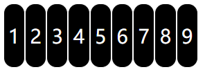

可是我们明明已经设置子元素的宽度为33.33%，从而我们可以得出了一个结论：

flex布局下的所有`项目(子元素)`默认排在一行，所有`项目(子元素)`的宽度之和超过父元素也不换行，而是按比例缩小所有`项目(子元素)`宽度，这其实是`项目(子元素)`的`flex-shrink`属性默认为`1`的缘故，下面的章节会学习该属性

## flex容器六大属性

- `flex-direction`
- `flex-wrap`
- `flex-flow`
- `justify-content`
- `align-items`
- `align-content`

## flex-direction

`flex-direction`属性决定子元素的排列方向

- `row`（默认）：所有`项目(子元素)`从左到右排列
- `row-reverse`：所有`项目(子元素)`从右到左排列
- `column`：所有(`项目子元素)`从上到下排列
- `column-reverse`：所有`项目(子元素)`从下到上排列

示例代码如下，布局样式变为9至1从左到右排列，且宽度等比缩放

```css
.flex-practise {
        width: 300px;
        height: 300px;
        /* 此处的下方编写css */
        display:flex;
        flex-direction: row-reverse;
        /* 此处的上方编写css */
      }
```

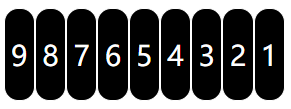

## flex-wrap

之前我们知道了：flex布局下的所有`项目(子元素)`默认排在一行，所有`项目(子元素)`的宽度之和超过父元素也不换行，而是按比例缩小所有`项目(子元素)`宽度

如果希望所有`项目(子元素)`的宽度之和超过父元素后换行，需要设置`flex-wrap`

- `nowrap`（默认）：不换行
- `wrap`：换行
- `wrap-reverse`：换行，`项目(子元素)`从下到上排列，即第一行在最下方，第二行在第一行上方

示例代码如下，布局样式变为3*3，且从右到左排列

```css
.flex-practise {
        width: 300px;
        height: 300px;
        /* 此处的下方编写css */
        display: flex;
        flex-direction: row-reverse;
        flex-wrap: wrap;
        /* 此处的上方编写css */
      }
```

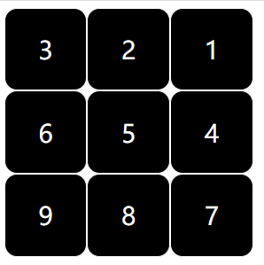

## flex-flow

flex-flow属性是`flex-direction`属性和`flex-wrap`属性的简写形式

默认值为`row` `nowrap`，即所有`项目(子元素)`从左到右排列且不换行

示例代码如下，布局样式变为3*3，且从右到左排列，同上方等价

```css
.flex-practise {
        width: 300px;
        height: 300px;
        /* 此处的下方编写css */
        display: flex;
        flex-flow: row-reverse wrap; 
        /* 此处的上方编写css */
      }
```

## justify-content

所有`项目(子元素)`在设置flex布局的父元素(`flex容器`)中横向的位置（所有`项目(子元素)`的宽度之和只占父元素(`flex容器`)宽度一部分的情况下）

- `flex-start（默认）`：居左
- `flex-end`：居右
- `center`： 居中
- `space-between`：两端对齐，子元素之间的间隔都相等
- `space-around`：子元素两侧的间隔相等。所以最左边和最右边子元素离边的间隔只有子元素之间间隔的一半

为了看到效果，修改item的width为20%

```css
.item {
        width: 20%;
        ...
}        
```

示例代码如下，布局样式变为在`横向上`居中排列

```css
.flex-practise {
        width: 300px;
        height: 300px;
        background-color: #eeeeee;
        /* 此处的下方编写css */
        display: flex;
        flex-wrap: wrap;
        justify-content: center;
        /* 此处的上方编写css */
      }
```

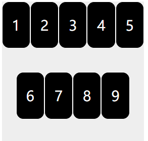

同时对`justify-content`和`flex-direction`设置，示例代码如下，

`justify-content: flex-end;`由`居右`变成`居左`，可见`justify-content`受`flex-direction`影响

```css
.flex-practise {
        width: 300px;
        height: 300px;
        background-color: #eeeeee;
        /* 此处的下方编写css */
        display: flex;
        flex-flow: row-reverse wrap;
        justify-content: flex-end;
        /* 此处的上方编写css */
      }
```

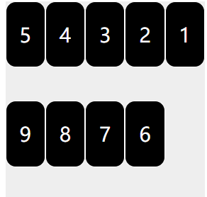

## align-items

子元素在父元素中纵向的位置（子元素的高度只占父元素高度一部分的情况下）

主要用于单行子元素，但多行也有效果

单行效果如下

- `flex-start`：：居上
- `flex-end`：居下
- `center`：居中
- `baseline`: 子元素的第一行文字的基线对齐
- `stretch（默认）`：如果子元素未设置高度或设为auto，将占满整个容器的高度

多行效果如下

- `flex-start`：：每行下方间隔相等
- `flex-end`：每行上方间隔相等
- `center`：每行上下间隔相等，所以最上边行和最下边行离边的间隔只有每行间隔的一半
- `baseline`: 子元素的每一行文字的基线对齐
- `stretch（默认）`：每行下方间隔一样

父元素没有固定高度，且没有设置`align-items`，即`align-items`值为`stretch（默认）`，则父元素高度由最高子元素决定

父元素设置`align-items:center`后，子元素的高度，由自身内容决定，此时再为子元素设置高度100%是没有作用的

这一点常见于设置表格样式

单行情况，示例代码与样式如下

```css
 .flex-practise {
        width: 300px;
        height: 300px;
        background-color: #eeeeee;
        /* 此处的下方编写css */
        display: flex;
        align-items: flex-end;
        /* 此处的上方编写css */
      }
```

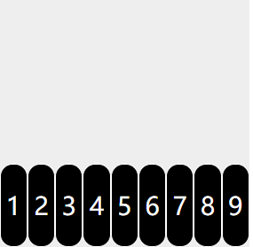

多行情况，示例代码与样式如下，每行上方间隔相等

```css
 .flex-practise {
        width: 300px;
        height: 300px;
        background-color: #eeeeee;
        /* 此处的下方编写css */
        display: flex;
        align-items: flex-end;
        /* 此处的上方编写css */
      }
```

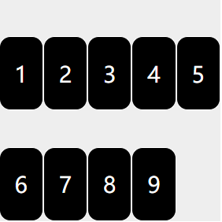

## align-content

`多行子元素`在父元素中纵向的位置

**`如果只有一行，该属性不起作用`**

`多行子元素`情况下，同时设置`align-items`和`align-content`，只有`align-content`生效

- `flex-start`：居上
- `flex-end`：居下
- `center`：居中排列
- `space-between`：上下两端对齐，每行之间的间隔相等
- `space-around`：每行上下间隔相等，所以最上边行和最下边行离边的间隔只有每行间隔的一半
- `stretch（默认值）`：下方间隔相等

单行情况，示例代码如下，没有效果

```css
 .flex-practise {
        width: 300px;
        height: 300px;
        background-color: #eeeeee;
        /* 此处的下方编写css */
        display: flex;
        align-content: flex-end;
        /* 此处的上方编写css */
      }
```

多行情况，示例代码如下，样式与`align-items`有明显区别，是把多行子元素作为一个整体

```css
 .flex-practise {
        width: 300px;
        height: 300px;
        background-color: #eeeeee;
        /* 此处的下方编写css */
        display: flex;
        align-content: flex-end;
        /* 此处的上方编写css */
      }
```

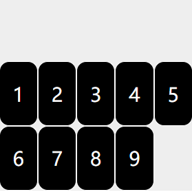

`多行子元素`情况下，同时设置`align-items`和`align-content`，只有`align-content`生效，而`单行子元素`情况下，`align-content`直接无效，故不用再进行比较

```css
.flex-practise {
        width: 300px;
        height: 300px;
        background-color: #eeeeee;
        /* 此处的下方编写css */
        display: flex;
        flex-wrap: wrap;
        align-items: flex-start;
        align-content: flex-end;
        /* 此处的上方编写css */
      }
```

## 项目(子元素)的六大属性

- `order`
- `flex-grow`
- `flex-shrink`
- `flex-basis`
- `flex`
- `align-self`

## order

`order`属性定义项目(子元素)的排列顺序。数值越小，排列越靠前，默认为0

为第九个子元素加一个nine的class

```html
  <div class="item nine">9</div>
```

设置`order`后，样式如下变化

```css
.nine {
        order: -1;
      }
```

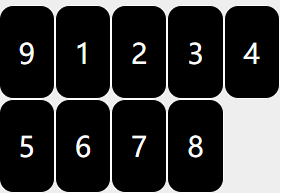


## flex-grow

`flex-grow`属性定义项目(子元素)的`放大比例`，默认为`0`，即如果存在剩余空间，也不放大

如果所有项目(子元素)的flex-grow属性都为`1`，则它们将等分父元素剩余空间（如果有的话）。如果一个项目(子元素)的flex-grow属性为`2`，其他项目(子元素)都为`1`，则前者占据的剩余空间将比其他项`多一倍`

为项目(子元素)设置`flex-grow: 1;`后，样式为

```css
 .item {
        flex-grow: 1;
        ...
       }
```


## flex-shrink

`flex-shrink`属性定义了项目(子元素)的`缩小比例`，默认为`1`，即如果空间不足，该项目(子元素)将缩小

即使为项目(子元素)设置了`固定宽度`，如果父元素宽度小于各项目(子元素)之和，还是会等比例缩小各项目(子元素)

所以如果不想宽度被缩小，需要设置项目(子元素)`flex-shrink`属性为`0`

```css
 flex-shrink: 0;
```

## flex-basis

`flex-basis`属性定义了在分配多余空间之前，项目(子元素)占据的主轴空间（main size）。浏览器根据这个属性，计算主轴是否有多余空间。

它的默认值为`auto`，即项目的本来大小

它可以设为跟`width`属性一样的值（比如100px），则项目将占据固定空间，即它不受`flex-shrink:1`的影响

```css
.nine {
        flex-basis: 100px;
      }
```

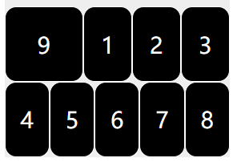

## flex

`flex`属性是`flex-grow`, `flex-shrink` 和 `flex-basis`的简写，默认值为`0 1 auto`，也就是三个属性的默认值，`后两个属性可选`

比较常见的是`flex: 1 `，其相当于`1 1 0%`，即等分父元素剩余空间，等比例缩小，不占据固定空间

所以``flex: 1 ``后，即使父元素设置`flex:wrap`，所有项目还是处于一行，且会等比例缩小，即使为项目(子元素)设置了`固定宽度`，还是会缩小于设置的width，因为不仅`flex-shrink`为`1`,且 `flex-basis`为`0%`

如果使用flex属性，修改第三个参数`flex-basis`的值即可设置`最小固定宽度`，且无需再设置宽

示例代码，则等分父元素剩余空间，等比例缩小但宽度最小为父元素50%

```css
.item {
        flex: 1 1 50%;
        color: #ffffff;
        display: flex;
        justify-content: center;
        align-items: center;
        font-size: 30px;
        background-color: #000000;
        border: 1px solid #fff;
        box-sizing: border-box;
        border-radius: 15px;
      }
```

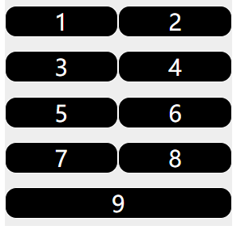

## align-self

`align-self`属性允许单个项目有与其他项目不一样的对齐方式，可覆盖`align-items`属性。默认值为`auto`，表示继承父元素的`align-items`属性，如果没有父元素，则等同于`stretch`。

- auto（默认值）
- flex-start
- flex-end
- center 
- baseline
-  stretch

## 垂直居中

非常常用的flex语法

~~~css
display: flex;
align-items: center;
justify-content: center;
~~~

