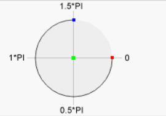

# canvas

> HTML5canvas元素用于图形的绘制, canvas标签只是图形容器，需要使用JS来绘制图形, 可以通过多种方法使用canvas绘制文本、线条、矩形、圆形等等

## 1.创建画布（固定）

固定写法，必须有一个canvas元素，width设置宽度，height设置高度，id用来获取这个canvas元素

```html
<canvas id="myCanvas" width="200" height="100"></canvas>
```

## 2.获取画布（固定）

固定写法，getContext("2d")是内置的HTML5对象，拥有多种绘制文本、线条、矩形、圆形等等的属性与方法

```js
const c= document.getElementById("myCanvas")
const ctx= c.getContext("2d")
```

## 3.使用js绘制（自定义）

```js
ctx.fillStyle="#FF0000"
ctx.fillRect(0,0,150,75)
```

## 坐标

canvas 是一个二维网格，canvas 的左上角坐标为 (0,0)，上面的 fillRect 方法拥有参数 (0,0,150,75)，意思是在画布上绘制 150x75 的矩形，从左上角开始 (0,0)

## 路径方法-beginPath

开始一条路径，或重置当前的路径

```json
ctx.beginPath()
```

## 路径方法-moveTo

路径移动到画布中的指定点，不创建线条

```js
ctx.moveTo(0,0)
```

| 参数 | 描述                    |
| :--- | :---------------------- |
| *x*  | 路径的目标位置的 x 坐标 |
| *y*  | 路径的目标位置的 y 坐标 |

## 路径方法-lineTo

添加一个新点，然后创建从该点到画布中最后指定点的线条，不创建线条

```js
ctx.lineTo(300,150)
```

| 参数 | 描述                    |
| :--- | :---------------------- |
| *x*  | 路径的目标位置的 x 坐标 |
| *y*  | 路径的目标位置的 y 坐标 |

## 路径属性-lineCap	

设置或返回线条的两端样式

- butt  默认，线条两端平直
- round  线条两端圆形
- square  线条两端正方形

round和square值会使线条略微变长

butt和square样式上基本没有区别

```js
ctx.lineCap="butt"
ctx.lineCap="round"
ctx.lineCap="square"
```

## 路径属性-lineWidth

设置或返回当前的线条宽度

```js
ctx.lineWidth=10
```

## 路径方法-stroke

绘制已定义的路径

以下方法定义的路径需要stroke绘制，默认颜色是黑色

- moveTo
- lineTo
- arc
- rect

```js
ctx.stroke()
```

## 路径方法-圆形-arc

创建弧/曲线/圆形/部分圆，需要调用stroke绘制

- arc(x,y,r,start,stop)

```js
ctx.arc(95,50,40,0,2*Math.PI)
```

| 参数               | 描述                                                |
| :----------------- | :-------------------------------------------------- |
| *x*                | 圆的中心的 x 坐标                                   |
| *y*                | 圆的中心的 y 坐标                                   |
| *r*                | 圆的半径                                            |
| *sAngle*           | 起始角，以弧度计（弧的圆形的三点钟位置是 0 度）     |
| *eAngle*           | 结束角，以弧度计                                    |
| *counterclockwise* | 可选，逆时针还是顺时针绘图，false顺时针，true逆时针 |

### Math.PI



## 路径方法-矩形-rect

创建矩形，需要调用stroke绘制

```js
ctx.rect(20,20,150,100)
```

| 参数     | 描述                 |
| :------- | :------------------- |
| *x*      | 矩形左上角的 x 坐标  |
| *y*      | 矩形左上角的 y 坐标  |
| *width*  | 矩形的宽度，以像素计 |
| *height* | 矩形的高度，以像素计 |

创建多个矩形

```js
// Red rectangle
ctx.beginPath()
ctx.lineWidth="6"
ctx.strokeStyle="red"
ctx.rect(5,5,290,140)
ctx.stroke()

// Green rectangle
ctx.beginPath()
ctx.lineWidth="4"
ctx.strokeStyle="green"
ctx.rect(30,30,50,50)
ctx.stroke()

// Blue rectangle
ctx.beginPath()
ctx.lineWidth="10"
ctx.strokeStyle="blue"
ctx.rect(50,50,150,80)
ctx.stroke()
```

## 路径方法-矩形-fillRect

绘制有填充的矩形，无需调用stroke

```js
ctx.fillRect(20,20,150,100)
```

## 路径方法-矩形-strokeRect

绘制无填充的矩形，无需调用stroke

```js
ctx.strokeRect(20,20,150,100)
```

## 路径方法-矩形-clearRect

在给定的矩形内清除指定的像素，无需调用stroke

```js
ctx.clearRect(20,20,100,50)
```

## 路径方法-fill

填充当前绘图/路径, 默认颜色是黑色

```js
ctx.fill()
```

:::tip

如果路径未关闭，那么fill方法会从路径结束点到开始点之间添加一条线，以关闭该路径（正如 closePath一样），然后填充该路径

:::

示例，自动填充为三角形

```js
 ctx.moveTo(0, 0)
 ctx.lineTo(300, 0)
 ctx.lineTo(300, 300)
```

## 路径属性-fillStyle 

设置或返回用于填充绘画的颜色、渐变或模式， 该属性默认\#000000

```js
ctx.fillStyle="#FF0000"
ctx.fillRect(20,20,150,100)
```

### 使用图像填充绘图

```js
const img = document.getElementById("lamp")
const pat = ctx.createPattern(img,"repeat")
ctx.rect(0,0,150,100)
ctx.fillStyle = pat
ctx.fill()
```

## 文本方法-font 

定义文本样式与字体

```js
ctx.font="30px Arial"
```

## 文本方法-fillText

fillText(*text,x,y*)，绘制实心的文本

```js
ctx.fillText("Hello World",10,50)
```

## 文本方法-strokeText

strokeText(*text,x,y*)，绘制空心的文本

```js
ctx.strokeText("Hello World",10,50)
```

## 渐变方法-createLinearGradient

createLinearGradient(*x,y,x1,y1*)，创建线性渐变

一般与fillStyle搭配使用

### 从上至下渐变

```js
const gradient = ctx.createLinearGradient(0,0,0,170)
gradient.addColorStop(0, "skyblue")
gradient.addColorStop(1, "white")
ctx.fillStyle= gradient
ctx.fillRect(20,20,150,100)
```

### 从左到右渐变

```js
const gradient = ctx.createLinearGradient(0,0,170,0)
gradient.addColorStop(0, "skyblue")
gradient.addColorStop(1, "white")
ctx.fillStyle= gradient
ctx.fillRect(20,20,150,100)
```

### 多色渐变

```js
const gradient = ctx.createLinearGradient(0, 0, 170, 0)
gradient.addColorStop(0, "skyblue")
gradient.addColorStop(0.8, "pink")
gradient.addColorStop(1, "white")
ctx.fillStyle = gradient
ctx.fillRect(20, 20, 150, 100)
```

## 渐变方法-createRadialGradient

createRadialGradient(*x,y,r,x1,y1,r1*) - 创建一个径向/圆渐变

```js
const grd=ctx.createRadialGradient(75,50,5,90,60,100)
grd.addColorStop(0,"red")
grd.addColorStop(1,"white")
 
// 填充渐变
ctx.fillStyle=grd
ctx.fillRect(10,10,150,80)
```

## 图像方法-drawImage

```js
const img=document.getElementById("img")
ctx.drawImage(img,10,10)
```

## 图像方法-createPattern

创建图案，可以是图片、视频或其他canvas，并指定图案的重复方式

```js
const img = document.getElementById("lamp")
const pattern = ctx.createPattern(img,"repeat")
ctx.rect(0,0,150,100)
ctx.fillStyle=pat
ctx.fill()
```

| 参数      | 描述                               |      |
| :-------- | :--------------------------------- | ---- |
| *image*   | 规定要使用的图片、视频或其他canvas |      |
| repeat    | 默认, 水平和垂直方向重复           |      |
| repeat-x  | 水平方向重复                       |      |
| repeat-y  | 垂直方向重复                       |      |
| no-repeat | 不重复                             |      |

## 综合示例-绘制饼图

```html
<!DOCTYPE html>
<html lang="en">

<head>
  <meta charset="UTF-8">
  <meta http-equiv="X-UA-Compatible" content="IE=edge">
  <meta name="viewport" content="width=device-width, initial-scale=1.0">
  <title>Document</title>
</head>
<canvas id="canvas" width="900" height="600" style="border: 1px solid #000;">

  <body>
    <script>
      var canvas = document.getElementById('canvas')
      var ctx = canvas.getContext('2d');
      //1.创建数据包(信息)
      var dataArr = [
        { name: '北京', color: 'yellow', value: 0.3 },
        { name: '上海', color: 'red', value: 0.2 },
        { name: '广州', color: 'green', value: 0.1 },
        { name: '深圳', color: 'purple', value: 0.15 },
        { name: '天津', color: 'blue', value: 0.25 }
      ];
      //2.定义圆心
      var x0 = canvas.width * 0.5, y0 = canvas.height * 0.5;//显示在画布中间
      //2.1定义半径
      var radius = 150;
      //2.2定义起始角度
      var beginAngle = -90 * Math.PI / 180
      // (定义初始角度为-90deg)
      //3.遍历,绘制扇形
      for (var i = 0; i < dataArr.length; i++) {
        //3.1扇形角度
        var tempAngle = dataArr[i].value * 360 * Math.PI / 180;
        //3.2结束角度
        var endAngle = beginAngle + tempAngle;
        //3.3开启路径
        ctx.beginPath();
        //3.4起点
        ctx.moveTo(x0, y0);
        //3.5绘制弧度
        ctx.arc(x0, y0, radius, beginAngle, endAngle);
        //3.6设置颜色
        ctx.fillStyle = dataArr[i].color;
        //3.7填充
        ctx.fill();
        //4.绘制文字
        //4.1常量
        var textAngle = beginAngle + tempAngle * 0.5; //角度
        var text = dataArr[i].name + dataArr[i].value * 100 + '%';
        console.log(text);
        //4.2文字坐标
        var textX = x0 + (radius + 30) * Math.cos(textAngle);
        var textY = y0 + (radius + 30) * Math.sin(textAngle);
        //4.3文字字号和字体
        ctx.font = "20px '微软雅黑'";
        //4.4判断文字是否在左边
        if ((textAngle > 90 * Math.PI / 180) && (textAngle < 270 * Math.PI / 180)) {
          ctx.textAlign = 'end';//文字的右侧在基线的左端
        }
        //4.5 绘制文字
        ctx.fillText(text, textX, textY);
        //5.更新起始角度, 将当前扇形的结束角度作为下一个扇形的起始角度
        beginAngle = endAngle;
      }
    </script>
  </body>
</html>
```

