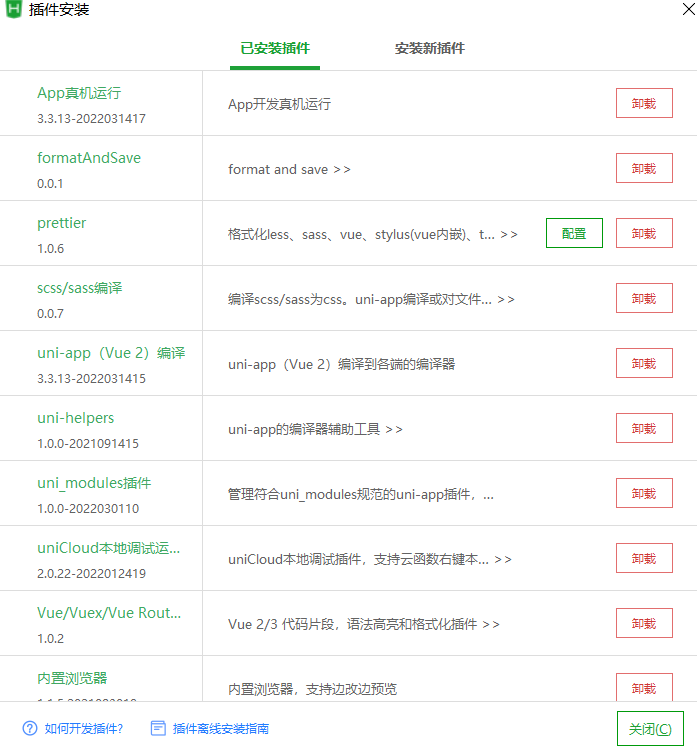

# 创建项目

## 开发工具安装

官网下载安装HBuilderX和微信小程序开发者工具

## 新建项目

打开HBuilderX，上方目录栏依次选择文件>新建>项目>选择uniapp->创建

## 运行

### 运行至浏览器

HBuilderX中上方目录栏依次选择，运行>运行到浏览器，打开相应浏览器

### 运行至小程序

HBuilderX中上方目录栏依次选择，运行>运行到小程序模拟器->运行设置，设置微信小程序工具路径为安装路径，如下(根据个人安装路径调整)：

需要去微信小程序开发者工具设置->安全->打开服务端口，才能正常运行


### 运行至手机

1. 手机中打开设置
2. 点击关于手机
3. 点击版本信息
4. 点击七次打开开发者模式
5. 回到设置首页
6. 点击其他设置
7. 点击开发者选项
8. 打开usb调试
9. 使用数据线连接电脑

正常情况下，HBuilderX中上方目录栏依次选择，运行>运行到手机或模拟器后，会显示自己的手机，运行到手机即可

### 运行至手机模拟器

有的机型不能正常连接调试，可以选择使用手机模拟器进行开发调试

1. 下载安装mumu手机模拟器
2. HBuilderX中上方目录栏依次选择，运行>运行到小程序模拟器>ADB路径设置
3. 设置路径为，mumu手机模拟器的安装路径bin目录下的adb_server.exe
4. , 设置模拟器端口为mumu手机模拟器默认端口7555
5. 重启HBuilderX后上方目录栏依次选择，运行>运行到小程序模拟器，出现了运行至mumu模拟器的选项

## 插件配置

个人插件列表




### prettier 

格式化less、sass、vue、stylus(vue内嵌)、ts、yaml代码

- printWidth： 控制单行最大长度
- semi： 控制每条语句是否加上分号
- tabWidth： 控制一个tab对应的空格数
- useTabs： 控制缩进用tab还是space
- singleQuote：控制字符串是用单引号还是双引号
- trailingComma： 是否去掉末尾的逗号
- bracketSpacing： 控制json对象括号前后是否加上空格
- parsers:  支持语言的文件后缀

```js
module.exports = {
  printWidth: 180,
  semi: false,
  tabWidth: 2,
  useTabs: false,
  singleQuote: true,
  trailingComma: "none",
  bracketSpacing: true,
  htmlWhitespaceSensitivity: "ignore",
  parsers: {
    ".jsx": "flow",
    ".scss": "scss",
    ".ts": "typescript",
    ".less": "css",
    ".vue": "vue",
    ".nvue": "vue",
    ".ux": "vue",
    ".yml": "yaml",
  }
}
```

## 导入iconfont文件

iconfont网站上将需要的icon图标加入购物车，下载解压，将文件夹中后缀名为ttf，woff，woff2，css的文件复制到项目中

## 修改iconfont.css文件的路径

路径使用~@和@都可以代表项目根目录

将其指向ttf，woff，woff2所在目录

```css
@font-face {
  font-family: "iconfont"; /* Project id 2786326 */
  src: url('~@/static/icon/iconfont.woff2?t=1630582491207') format('woff2'),
       url('@/static/icon/iconfont.woff?t=1630582491207') format('woff'),
       url('@/static/icon/iconfont.ttf?t=1630582491207') format('truetype');
}
```

## 在项目中导入iconfont.css

```js
import '@/common/iconfont.css'
```

## 使用uni-section

并不是uni-ui配置好的组件，需要手动去uni-ui模板中复制该组件为easycom

## hbuilderx主题设置

hbuilderx总共有三种主题，绿柔主题Default,酷黑主题Monokai,雅黑主题Atom One Dark,修改主题色是基于三种主题之一的，不能直接创建一个新主题，比如下方配置是基于Atom One Dark(对象名为[Atom One Dark])，则当前hbuilderx必须处于雅黑主题，配置才能有作用

工具>设置>源码视图>Settings.json中加入以下配置

```json
"workbench.colorCustomizations": {
   //    "[Default]": {// 绿柔主题
    //        "sideBar.background":"#faf6e6", // 项目管理器背景颜色
    //        "editor.background":"#faf6e6" // 编辑区域背景颜色
    //    },
    //    "[Monokai]": {// 酷黑主题
    //        "toolBar.background": "#272822", 
    //        "sideBar.background":"#272822" 
    //    },
    "[Atom One Dark]": {
      "sideBar.background": "#212224",
      "editor.background": "#18191A" //
    }
  },
  "editor.tokenColorCustomizations": {
    //    "[Default]": {// 绿柔主题
    //        "rules": [{}]
    //    },
    //    "[Monokai]": {// 酷黑主题
    //         "rules": [{}]
    //    },
    "[Atom One Dark]": {
      "rules": [{
        "scope": [
          "support.type.property-name"
        ],
        "settings": {
          "foreground": "#9CDCFE"
        }
      }, {
        "scope": [
          "support.constant.property-value.css"
        ],
        "settings": {
          "foreground": "#B5CEA8"
        }
      }, {
        "scope": [
          "variable.other.readwrite.js",
          "variable.other.readwrite.tsx",
          "variable.other.readwrite.ts"
        ],
        "settings": {
          "foreground": "#FFD710"
        }
      }, {
        "scope": [
          "text.html.vue"
        ],
        "settings": {
          "foreground": "#61AFEF"
        }
      }, {
        "scope": [
          "string"
        ],
        "settings": {
          "foreground": "#6CD8A6"
        }
      }]
    }
  }
```

- workbench.colorCustomizations中sideBar.background控制项目管理器背景颜色
- workbench.colorCustomizations中editor.background控制编辑区域背景颜色
- editor.tokenColorCustomizations设置代码块的对应颜色
- 如何设置代码块颜色：1.光标点击代码块 2.工具>主题>inspect tokens and colors 3.控制台将打印代码块规则 4.复制到Settings.json的rules规则中即可自定义代码块颜色

## 打包安卓

### 打包流程

1. 发行->原生App(云打包)
2. 安卓应用发布需要证书，因为只是个人的项目，使用公共测试证书即可,  发布安卓应用商店，请查看https://ask.dcloud.net.cn/article/35777
3. 点击打包，在等待后会生成apk文件，发送apk文件至手机即可安装应用		

### 应用设置

- 设置应用名：manifest.json->基础配置->应用名称
- 设置应用icon：manifest.json->App图标设置，选择图片路径然后点击`自动生成所有图标并替换`
- 设置支持64位架构：manifest.json->App常用其他配置->支持cpu类型，勾选arm64-v8a


## 切换vue3

manifest.json中选择版本为vue3,运行项目则会自动安装vue3编译插件，最后重新启动项目即可使用composition语法


