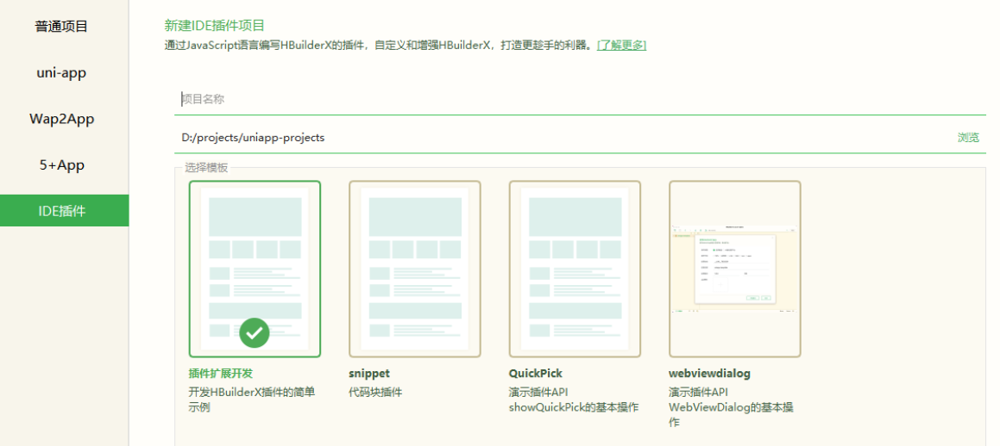

# 开发HbuilderX插件

## 创建插件项目

1.依次选择文件->新建项目->创建->IDE插件



## package.json

设置插件相关信息与功能

| key              | 说明               |
| ---------------- | ------------------ |
| activationEvents | 插件激活事件       |
| contributes      | 插件相关功能配置   |
| commands         | 设置插件命令       |
| menus            | 设置右键菜单       |
| keybindings      | 设置插件命令快捷键 |

```json
{
  "id": "zqy-formatAndSave",
  "name": "formatAndSave", 
  "description": "format and save",
  "displayName": "formatAndSave",
  "version": "0.0.1",
  "publisher": "zqy",
  "engines": {
    "HBuilderX": "^2.7.0"
  },
  "categories": [
    "Other"
  ],
  "main": "./extension",
  "activationEvents": [
    "onCommand:extension.formatAndSave"
  ],
  "contributes": {
    "commands": [
      {
        "command": "extension.formatAndSave",
        "title": "formatAndSave"
      }
    ],
    "menus": {
      "editor/context": [
        {
          "command": "extension.formatAndSave",
          "group": "z_commands",
          "when": "editorTextFocus"
        },
        {
          "group": "z_commands"
        }
      ]
    },
    "keybindings": [
      {
        "command": "extension.formatAndSave",
        "key": "Ctrl+S",
        "when": "editorTextFocus"
      }
    ]
  },
  "extensionDependencies": [
    "plugin-manager"
  ],
  "dependencies": {}
}
```

## 插件主函数

extension.js

```js
var hx = require("hbuilderx");
//该方法将在插件激活的时候调用
function activate(context) {
	let disposable = hx.commands.registerCommand('extension.formatAndSave', async() => {
         await hx.commands.executeCommand("editor.action.format")
		 hx.commands.executeCommand("workbench.action.files.save")
	});
	//订阅销毁钩子，插件禁用的时候，自动注销该command。
	context.subscriptions.push(disposable);
}
//该方法将在插件禁用的时候调用（目前是在插件卸载的时候触发）
function deactivate() {

}
module.exports = {
	activate,
	deactivate
}
```

## 插件发布

直接压缩插件项目为zip，然后至官网提交即可

## 本地插件使用

放在HBuilderx安装目录下的plugins中，卸载的话删除即可

## 分栏

```js
const hx = require("hbuilderx")
//该方法将在插件激活的时候调用
function activate(context) {
  let num = 0
  let disposable = hx.commands.registerCommand("extension.copyEditorAutoFold", async () => {
    num++
    // 偶数次数表示已打开分栏，进行关闭
    if (num % 2 == 0) {
      return hx.commands.executeCommand("workbench.action.split1e")
    }
    // 奇数次数表示打开分栏
    let activeEditor = await hx.window.getActiveTextEditor()
    let document = activeEditor.document
    let word = document.getText()
    // 折叠template和style
    const templateIndex = word.indexOf("<template>")
    activeEditor.setSelection(templateIndex, templateIndex)
    await hx.commands.executeCommand("workbench.action.foldChildrenContract")
    const styleIndex = word.indexOf("<style")
    activeEditor.setSelection(styleIndex, styleIndex)
    await hx.commands.executeCommand("workbench.action.foldChildrenContract")
    const scriptIndex = word.indexOf("<script")
    activeEditor.setSelection(scriptIndex, scriptIndex)
    // 复制右侧分栏，会复制左侧光标位置,折叠script
    await hx.commands.executeCommand("workbench.action.copyEditor")
    await hx.commands.executeCommand("workbench.action.foldChildrenContract")
  })
  //订阅销毁钩子，插件禁用的时候，自动注销该command
  context.subscriptions.push(disposable)
}
//该方法将在插件禁用的时候调用（目前是在插件卸载的时候触发）
function deactivate() {}
module.exports = {
  activate,
  deactivate
}
```


           
```json
///*
// # HBuilderX的快捷键理念
// HBuilderX的快捷键原则是：不定义记不住的快捷键
// 过去的很多工具都提供了太多abcd的快捷键，完全记不住
// HBuilderX在定义每个快捷键时都经过了考量，记住如下原则，就可掌握大部分快捷键
// 1. 尽可能保持与OS、浏览器接近
// 如标签卡管理，与浏览器完全相同，ctrl+t新建标签卡、ctrl+shift+t恢复刚关闭的标签卡、ctrl+w关闭标签卡、ctrl+pagedown/pageup切换标签卡
// 对于习惯eclipse体系ctrl+t寻找文件的用户，需记得寻找文件的快捷键已经调整为ctrl+p
// 2. 界面快捷键都与alt相关
// 你可以把键盘方位当做屏幕，q为左上角字母，那么alt+q为显示/关闭左侧的项目管理器
// q旁边的w是文档结构图(大纲)，即alt+w为显示/关闭文档结构图
// 右上角字母是p，即alt+p显示/关闭右侧的预览
// alt+n为置焦编辑器
// alt+x（底部字母）为显示/关闭控制台
// alt+c（底部字母）为显示/关闭终端
// alt+数字，是切换相应位置的标签卡，比如alt+1是转到第一个标签卡
// alt+[是在各种括号之间跳转
// alt+d是转到定义（F12也可以），shift+alt+d或shift+F12则是分栏转到定义
// 在windows下，alt+字母同时是菜单的&快捷键，可触发相应菜单功能，比如按下alt+v r，即可展开视图菜单并选中自动换行命令。菜单名称后面括号里的英文，即为对应的触发快捷字母
// 3. ctrl是操作、ctrl+shift是反操作或更多操作、ctrl+alt为更多操作
// ctrl+k是格式化，那么ctrl+shift+k就是合并为一行
// ctrl+w是关闭当前标签卡，那么ctrl+shift+w是关闭所有标签卡
// ctrl+f是搜索，ctrl+alt+f是目录内搜索
// 4. 符号化而不是单词字母化
// 包围的英文是surround，但从这个单词里选一个字母配合ctrl定为快捷键是很难记住的。HBuilderX里ctrl+]是包围，ctrl+shift+]是反包围，这样好记多了
// ctrl+shift+|是给选中行每行设置光标，“|”就是光标的样子，很形象
// 5. 强化和鼠标的配合，更易用
// alt+鼠标滚轮是横向滚动
// alt+鼠标单击是转到定义
// alt+鼠标拖动是列选择
// ctrl+鼠标单击是添加多光标
// 鼠标双击可以智能选中，详见选择菜单
// 6. 老HBuilder用户需注意的常见快捷键差异
// 寻找文件从ctrl+t改为ctrl+p
// 格式化从ctrl+shift+f改为ctrl+k
// 合并行从ctrl+j改为ctrl+shift+k
// ctrl+e为选中相同词
// 
// 7. sublime/vscode用户需注意常见快捷键差异
// ctrl+d为删除当前行
// ctrl+e为选中相同词
// 打开控制台不是ctrl+~而是alt+x
// 合并行从ctrl+j改为ctrl+shift+k
// 在每行行首设置光标是ctrl+shift+\\而不是ctrl+shift+l
// 选择括号内容是ctrl+[而不是ctrl+shift+m
// ctrl+]是加包围。除了包围tag还支持包围if等函数块。同时提供ctrl+shift+]为反包围
// 调缩进是tab或shift+tab，不是ctrl+[和]
// 选择tag、相同缩进，可以双击tag首尾或缩进符号，不用背快捷键
// 扩大选区是ctrl+=
// 复制行或选区是ctrl+insert而不是ctrl+shift+d
// 当然在右上角，你也可以点击下拉菜单，切换其他工具的快捷键方案
//*/


//--------标签卡--------
//新建标签卡（默认md）
{"key":"ctrl+t","command":"workbench.action.files.newUntitledFile"},
//关闭当前标签卡
{"key":"ctrl+w","command":"workbench.action.closeActiveEditor"},
{"key":"ctrl+f4","command":"workbench.action.closeActiveEditor"},
//关闭当前标签卡，不询问是否保存
// {"key":"ctrl+f4","command":"workbench.action.closeActiveEditorNoConfirm"},
//关闭所有标签卡
{"key":"ctrl+shift+w","command":"workbench.action.closeAllEditors"},
//关闭其他文件
{"key":"ctrl+q","command":"workbench.action.closeOtherEditors"},
//关闭右侧标签卡
// {"key":"","command":"workbench.action.closeRightEditor"},
//关闭所有已保存标签卡
// {"key":"","command":"workbench.action.closeAllSavedEditors"},
//显示左边的标签卡
{"key":"ctrl+PgUp","command":"workbench.action.leftTab"},
//显示右边的标签卡
{"key":"ctrl+PgDown","command":"workbench.action.rightTab"},
//复制标签卡到分栏
{"key":"","command":"workbench.action.copyEditor"},
//重开已关闭标签卡
{"key":"ctrl+shift+t","command":"workbench.action.reopenClosedEditor"},
//切换最近的标签卡ctrl+tab，该快捷键无法自定义
//切换到第1个标签卡
{"key":"alt+1","command":"workbench.action.openEditorAtIndex1"},
//切换到第2个标签卡
{"key":"alt+2","command":"workbench.action.openEditorAtIndex2"},
//切换到第3个标签卡
{"key":"alt+3","command":"workbench.action.openEditorAtIndex3"},
//切换到第4个标签卡
{"key":"alt+4","command":"workbench.action.openEditorAtIndex4"},
//切换到第5个标签卡
{"key":"alt+5","command":"workbench.action.openEditorAtIndex5"},
//切换到第6个标签卡
{"key":"alt+6","command":"workbench.action.openEditorAtIndex6"},
//切换到第7个标签卡
{"key":"alt+7","command":"workbench.action.openEditorAtIndex7"},
//切换到第8个标签卡
{"key":"alt+8","command":"workbench.action.openEditorAtIndex8"},
//切换到第9个标签卡
{"key":"alt+9","command":"workbench.action.openEditorAtIndex9"},
//切换到最末尾的标签卡
{"key":"alt+0","command":"workbench.action.openEditorAtIndex0"},
//往左移动一个标签卡
{"key":"ctrl+shift+PgUp","command":"workbench.action.moveEditorLeftInGroup"},
//往右移动一个标签卡
{"key":"ctrl+shift+PgDown","command":"workbench.action.moveEditorRightInGroup"},
```


​    


​    
```json
//--------跳转--------
//光标向左
{"key":"alt+h","command":"cursorLeft"},
{"key":"left","command":"cursorLeft"},
//光标向下
{"key":"alt+j","command":"cursorDown"},
{"key":"down","command":"cursorDown"},
//光标向上
{"key":"alt+k","command":"cursorUp"},
{"key":"up","command":"cursorUp"},
//光标向右
{"key":"alt+l","command":"cursorRight"},
{"key":"right","command":"cursorRight"},
//光标向左一词
{"key":"ctrl+left","command":"cursorWordStartLeft"},
//光标向右一词
{"key":"ctrl+right","command":"cursorWordEndRight"},
//光标向左一个驼峰单词
{"key":"ctrl+alt+left","command":"cursorWordPartLeft"},
//光标向右一个驼峰单词
{"key":"ctrl+alt+right","command":"cursorWordPartRight"},
//光标到软行首（连续按依次切换自动换行的行首、缩进后的行首、真行首）
{"key":"home","command":"cursorHome"},
//光标到软行尾（连续按依次切换自动换行的行尾、真行尾）
{"key":"end","command":"cursorEnd"},
//光标到行首
{"key":"","command":"cursorLineStart"},
//光标到行尾
{"key":"","command":"cursorLineEnd"},
//光标到上个段落（空行为分割段落）
{"key":"ctrl+alt+PgUp","command":"cursorParaUp"},
//光标到下个段落（空行为分割段落）
{"key":"ctrl+alt+PgDown","command":"cursorParaDown"},
//光标到上一页
{"key":"PgUp","command":"cursorPageUp"},
//光标到下一页
{"key":"PgDown","command":"cursorPageDown"},
//光标到页首
{"key":"ctrl+home","command":"cursorTop"},
//光标到页尾
{"key":"ctrl+end","command":"cursorBottom"},
//转到定义
{"key":"alt+d","command":"workbench.action.gotoDefinition"},
{"key":"f12","command":"workbench.action.gotoDefinition"},
//分栏转到定义
{"key":"alt+shift+d","command":"workbench.action.gotoDefinitionWithPane"},
{"key":"shift+f12","command":"workbench.action.gotoDefinitionWithPane"},
//跳转到行
{"key":"ctrl+g","command":"workbench.action.gotoLine"},
//跳转到配对的括号
{"key":"alt+[","command":"editor.action.jumpToBracket"},
//光标后退
{"key":"alt+left","command":"workbench.action.navigateBack"},
//光标前进
{"key":"alt+right","command":"workbench.action.navigateForward"},
//光标历史清空
//{"key":"","command":"workbench.action.clearPosHistory"},
//设置/取消书签
{"key":"ctrl+f2","command":"workbench.action.toggleBookmark"},
//下一个书签（光标在编辑器区域）
{"key":"f2","command":"workbench.action.nextBookmark"},
//上一个书签（光标在编辑器区域）
{"key":"shift+f2","command":"workbench.action.prevBookmark"},
//清除所有书签
{"key":"ctrl+shift+f2","command":"workbench.action.clearBookmarks"},
//下一个验证错误
{"key":"f4","command":"workbench.action.nextError"},
//上一个验证错误
{"key":"shift+f4","command":"workbench.action.prevError"},
//折叠单行
{"key":"alt+-","command":"workbench.action.foldLineContract"},
//展开单行
{"key":"alt+=","command":"workbench.action.foldLineExpand"},
//折叠子行
{"key":"alt+shift+-","command":"workbench.action.foldChildrenContract"},
//展开子行
{"key":"alt+shift+=","command":"workbench.action.foldChildrenExpand"},
//折叠所有行
{"key":"alt+ctrl+shift+-","command":"workbench.action.foldAllContract"},
//展开所有行
{"key":"alt+ctrl+shift+=","command":"workbench.action.foldAllExpand"},
//
//折叠其他区域
{"key":"alt+shift+o","command":"workbench.action.foldContractOther"},
//转到Page.json（在uni-app的page页面可快速转到Page.json里对应的节点）
//{"key":"","command":"workbench.action.openPageJsonFile"},
```

```json
//--------视图--------
//置焦到编辑器区域
{"key":"alt+n","command":"workbench.action.focusEditor"},
//置焦到项目管理器
{"key":"alt+shift+q","command":"workbench.view.explorer"},
//免打扰模式
{"key":"command+ctrl+f","command":"workbench.action.distanceFreeMode"},
//单栏
{"key":"alt+shift+1","command":"workbench.action.split1e"},
//左右2栏
{"key":"alt+shift+2","command":"workbench.action.split2e"},
//左右3栏
{"key":"alt+shift+3","command":"workbench.action.split3e"},
//四宫格
// {"key":"alt+shift+5","command":"workbench.action.split4grid"},
//置焦到下一个分栏
{"key":"alt+.","command":"workbench.action.nextpane"},
//置焦到上一个分栏
{"key":"alt+,","command":"workbench.action.prevpane"}
```
```
const hx = require("hbuilderx")

//该方法将在插件激活的时候调用
function activate(context) {
  let formatAndSave = hx.commands.registerCommand("extension.formatAndSave", async () => {
    let activeEditor = await hx.window.getActiveTextEditor()
    console.log(activeEditor.document)
    await hx.commands.executeCommand("editor.action.format")
    hx.commands.executeCommand("workbench.action.files.save")
  })
  let num = 0
  let editorName = ""
  let copyEditorAutoFold = hx.commands.registerCommand("extension.copyEditorAutoFold",  () => {
  
    let activeEditor = await hx.window.getActiveTextEditor()
   console.log(activeEditor.document)
   // await hx.commands.executeCommand("workbench.action.split1e")
   // let activeEditor = await hx.window.getActiveTextEditor()
    
    
    
  //   num++
  //   // 偶数次数表示已打开分栏，进行关闭
  //   if (num % 2 == 0) {
  //     await hx.commands.executeCommand("workbench.action.split1e")
  //     // await hx.commands.executeCommand("workbench.action.closeActiveEditor")
  //     return hx.commands.executeCommand("workbench.action.foldAllExpand")
  //   }
  //   // 奇数次数表示打开分栏
  //   let config = hx.workspace.getConfiguration("formatAndSave")
  //   const mode = config.get("mode")
  //   let activeEditor = await hx.window.getActiveTextEditor()

  //   const word = activeEditor.document.getText()
  //   const scriptIndex = word.indexOf("<script")
  //   console.log(scriptIndex)
  //   const templateIndex = word.indexOf("<template")
  //   const styleIndex = word.indexOf("<style")
  //   if (mode) {
  //     // 折叠script
  //     activeEditor.setSelection(scriptIndex, scriptIndex)
  //     await hx.commands.executeCommand("workbench.action.foldChildrenContract")
  //     //  复制分栏，会复制左侧光标位置
  //     await hx.commands.executeCommand("workbench.action.copyEditor")
  //     if (scriptIndex == -1) return
  //     await hx.commands.executeCommand("workbench.action.foldAllContract")
  //     await hx.commands.executeCommand("workbench.action.foldChildrenExpand")
  //   } else {
  //     activeEditor.setSelection(templateIndex, templateIndex)
  //     await hx.commands.executeCommand("workbench.action.foldChildrenContract")
  //     activeEditor.setSelection(styleIndex, styleIndex)
  //     await hx.commands.executeCommand("workbench.action.foldChildrenContract")
  //     activeEditor.setSelection(scriptIndex, scriptIndex)
  //     // 复制分栏，会复制左侧光标位置
  //     await hx.commands.executeCommand("workbench.action.copyEditor")
  //     if (scriptIndex == -1) return
  //     await hx.commands.executeCommand("workbench.action.foldChildrenContract")
  //   }
  })
  //订阅销毁钩子，插件禁用的时候，自动注销该command
  context.subscriptions.push(formatAndSave)
  context.subscriptions.push(copyEditorAutoFold)
}
//该方法将在插件禁用的时候调用（目前是在插件卸载的时候触发）
function deactivate() {}
module.exports = {
  activate,
  deactivate
}

```

目前思路，监听打开新的标签页
